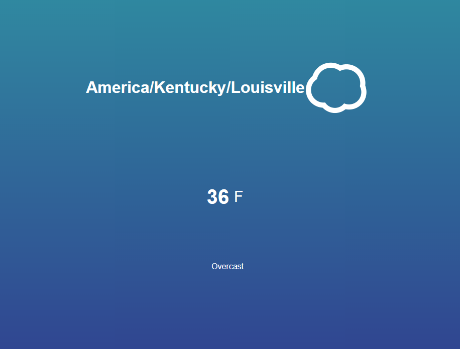

## JS Weather App w/ Darksky API

This is a simple location-based weather app that will tell you the current temperature at your location in both fahrenheit and celsius. The app is built in vanilla JavaScript and the data is pulled from the Darksky API.

